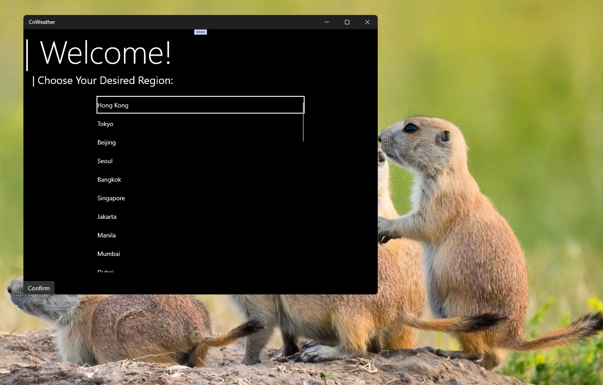
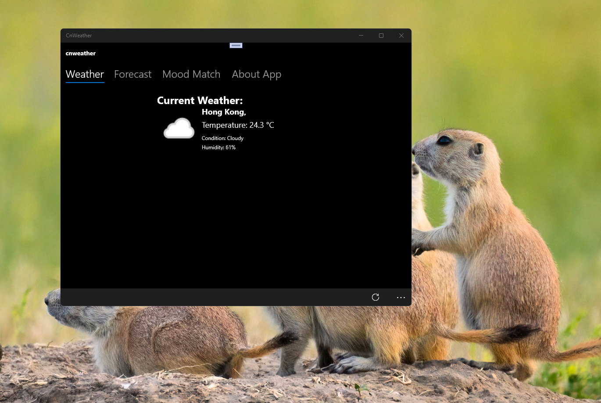
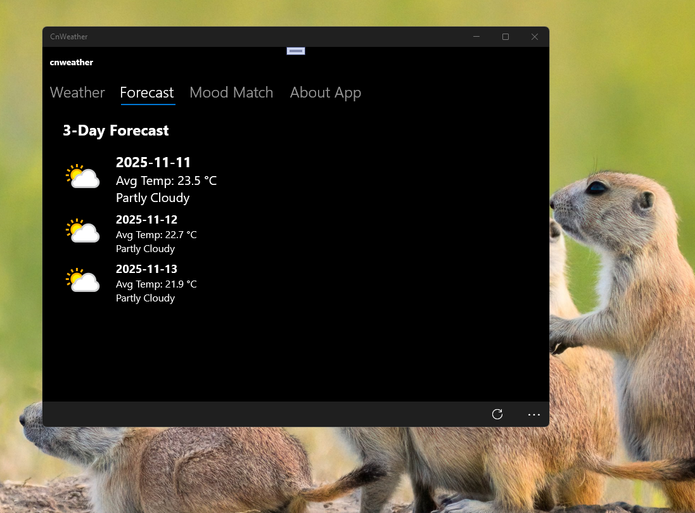

# CnWeather 1.0 - main branch

My quick and dirty port of WP7 CnWeather app for UWP (Universal Windows Platform).

## Screenshots

## Features

- World regions

- Current weather

- Weather forecast

- Background tasks (agent)

## References

- ChockingNetDude (Telegram@chockingnetdude)

## Main goal

- Background tasks exploring (exploration) and using for LunaVK, etc.

## .

As is. No support. Educational purposes only. DIY.

## ..

[m]\[e] 2025

